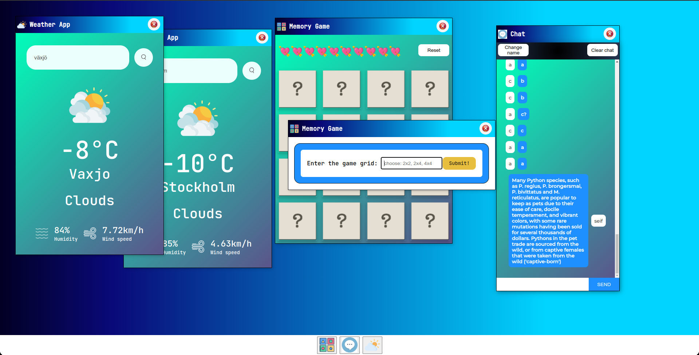

# A3 SPA -- [Video Presentation](https://www.youtube.com/watch?v=mZqCvYyLyjc)



## Description
This is a Single Page Application (SPA) developed with pure JavaScript, HTML and CSS. 
The SPA contains three applications, a memory card game and a chat app which were mandatory, and the weather app which was an app of my choice. 
You can drag the windows by clicking on the titlebar and place it where you want. 
If you have multiple windows opened, you can click on window anywhere to bring it to the front. 


## Instructions and Usage
Clone the repo 

```
git clone git@gitlab.lnu.se:1dv528/student/sy222ea/a3-spa.git
```
<br>

Navigate to the repo
```
cd your_desired_path/a3-spa
```

To be able to run the application and the linters you will first need node package manager

```
npm install
```

Run Linters. This will run all 3 linters i.e. htmlhint, stylelint and eslint
```
npm run lint
```
<br>

# Try the website 

Launch the application by typing

```
npm run serve
```
or type
```
npm run http-server dist
```
____________________________________________________________________________<br>

## Start and play the Game
The game is available in three grid sizes, 2x2, 2x4 and 4x4. You launch a new game by clicking 
on the game icon on the taskbar, when you launch a new game window, you will have to enter the grid size you want [2x2, 2x4, 4x4]. You can open multiple game windows. 
<br>
play the game by clicking on the cards with the mouse or by navigating the cards with keyboard and pressing 'Enter' on the card you want to open. 
<br>
Rules: When you click on one card it will be flipped until you click on a second one, if the second one matches the first one, they will both remain flipped otherwise they will be flipped back down. 
Note that you are not allowed to click on cards that are already flipped. 
When you play the game you will have a fixed number of 'lives', with every bad try you lose one life. 
Every grid will have a set difficulty level, in the 2x2 grid you have two 'lives', and in the 2x4 you have 6 and 10 lives for the biggest grid 4x4. 
<br>
The reset button can be used while playing the game, in case you want to start over. 

____________________________________________________________________________<br>


## The Weather App
Launch weather app windows by clicking on the weather app icon on the taskbar. 
In the weather app you have to type correct city name and press enter or click the search icon. 
Typing incorrect city name will just show an error message. 


____________________________________________________________________________<br>

## The Chat application 
Launch weather app windows by clicking on the weather app icon on the taskbar.
When you launch the chat app for the first time you will have to enter a name then a chat window will appear and the name will be saved to web local storage. All messages are saved to web local storage. 

In the chat window you have the ability to change your name or clear the chat. These changes will be updated to the web local storage as well. 

All messages are being sent and recieved within the 'my, not so secret, channel'


